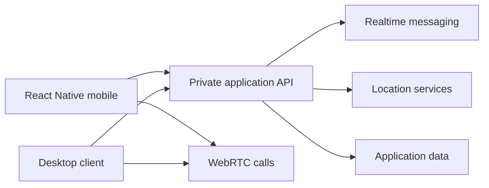

# Venu

Venu is a location-aware social platform with real-time chat, calls, and mobile
clients.

[Launch the interactive product demo](https://ayoubodf-dev.github.io/venu-showcase/)

## Highlights

- React Native mobile experience
- Location-aware discovery
- Real-time chat and presence
- Voice and video calling
- Desktop companion experience

## Architecture

## Source availability

The mobile, desktop, and backend implementations are private and proprietary.
This public repository is a source-free product showcase.

Copyright © 2026 Ayoub Odf. All rights reserved.
